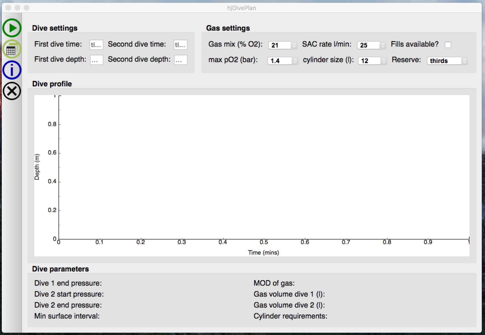

# hjDivePlan
## About
A simple dive planner written using PyQt <https://riverbankcomputing.com/software/pyqt/intro> using the PADI recreational dive planner (RDP: http://elearning.padi.com/company0/tools/RDP_Table%20Met.pdf).

This software comes with no guarantee  and should be used at your own risk.

## Installation

At present precompiled binaries are not available. To program has the following dependencies:

  * python2.7
  * PyQt4
  * pyqtgraph
  * numpy
  
These can be installed using conda (available from: <https://www.continuum.io/downloads>) by running the follwing commands in your terminal:

```bash
$ conda env create -f dive_env.yml
$ source activate dive_env
$ git clone https://github.com/henryjuho/hjDivePlan.git
```

## Running hjDivePlan

To run the program then issue:

```
$ cd hjDivePlan
$ ./hjDivePlan
```

This should result in the program window opening:

